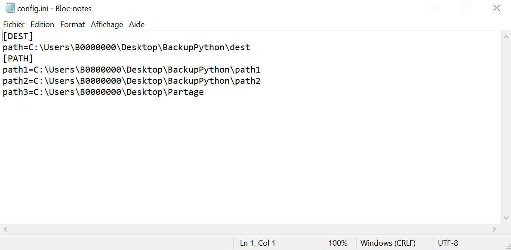

# <b>🐍 Python Backup Script 🐍</b>

This script permit to backup all folders mentionned in config.ini file.

Edit DEST path and put the path of destination to all your backuped files.

The backup system will create a folder in your destination folder.

Example of backup folder created : `backup_09-03-2020_9h38m45s`

In order to add new path to backup just add  `path(n+1)="yourpath" ` in config.ini

For example after path3 line :  `path4="C:\wamp64\www" ` 

The git folder contain a .exe file associated with a config.ini in \dist 